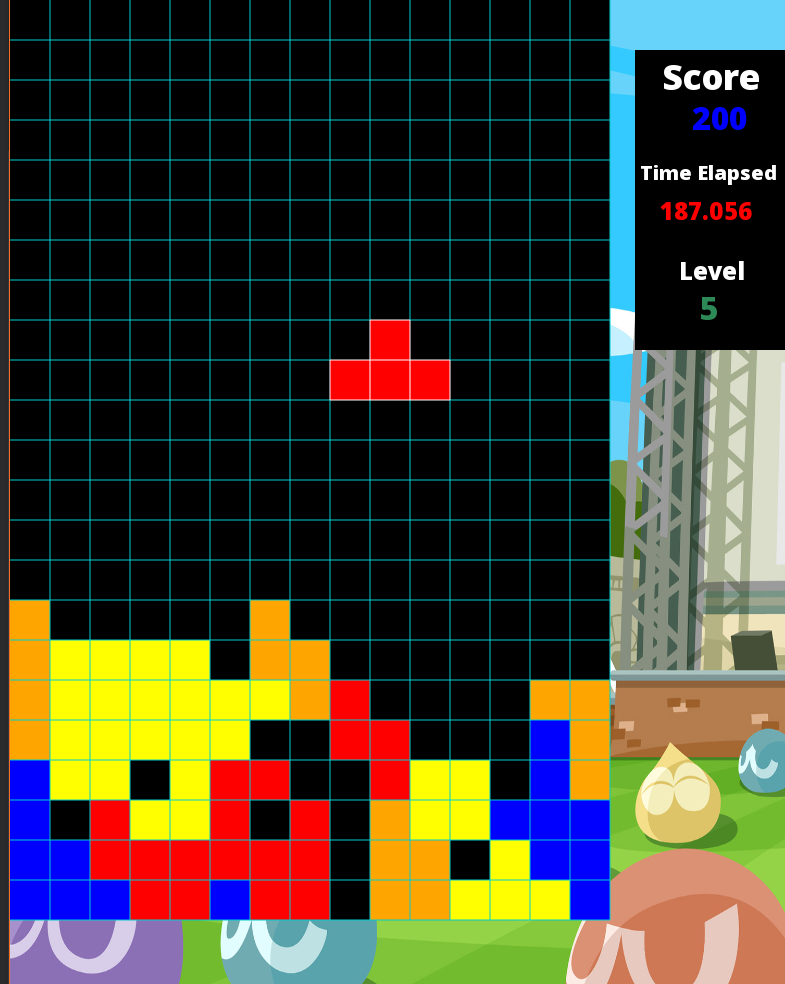

# Final Project - Tetris

- For my final project, I decided to create my own implementation of Tetris using OpenFrameworks.
- For this project, I used libraries from OpenFrameworks such as ofSoundPlayer, ofGraphics, ofImage, and ofTrueTypeFont.

# Rules
- In Tetris, the player must manipulate the tetromino blocks as the fall to the bottom of the board. 
  - The main goal is to not fill up the board.
  - Rows can be cleared if a complete row is filled with tetrominoes. 
    - This will result in advancing to the next level, causing the tetrominoes to fall faster.
- The score is determined by the number of rows cleared and where on the board they were cleared. 
  - For example, a row cleared at the top of the board will be worth more than a row cleared at the bottom of the board.
  - And a row is worth more if it is cleared at a higher round, due the difficulty.
 - The player loses when a tetromino is generated and it cannot move down.

# Controls
- Use the arrow keys to move the tetromino blocks to the left, right, or down. 
  - tetromino blocks cannot be moved upwards.
  - you cannot slide the tetrominoes off of the game board.
- Use the right 'a' and 's' key to rotate the tetromino block clockwise and counterclockwise.
- The game can be paused by pressing the 'p' key. 
- The background music can be paused by pressing the 'm' key.

# Setting up to run Tetris
- In order to run Tetris on your machine, you must have an IDE such as [Xcode](https://developer.apple.com/xcode/)
 or [Visual Studio](https://visualstudio.microsoft.com/). 
- After properly installing and setting up the IDE, download [OpenFrameworks](https://openframeworks.cc/).
- After the download is complete, open the OpenFrameworks folder and run the project generator.
- Use your IDE to clone the repository and save the folder on your PC.
- In the OpenFrameworks project generator click on import and select the folder that was just saved with the repository. 
- Once the program is imported, the game can be run through the IDE. 

